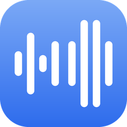
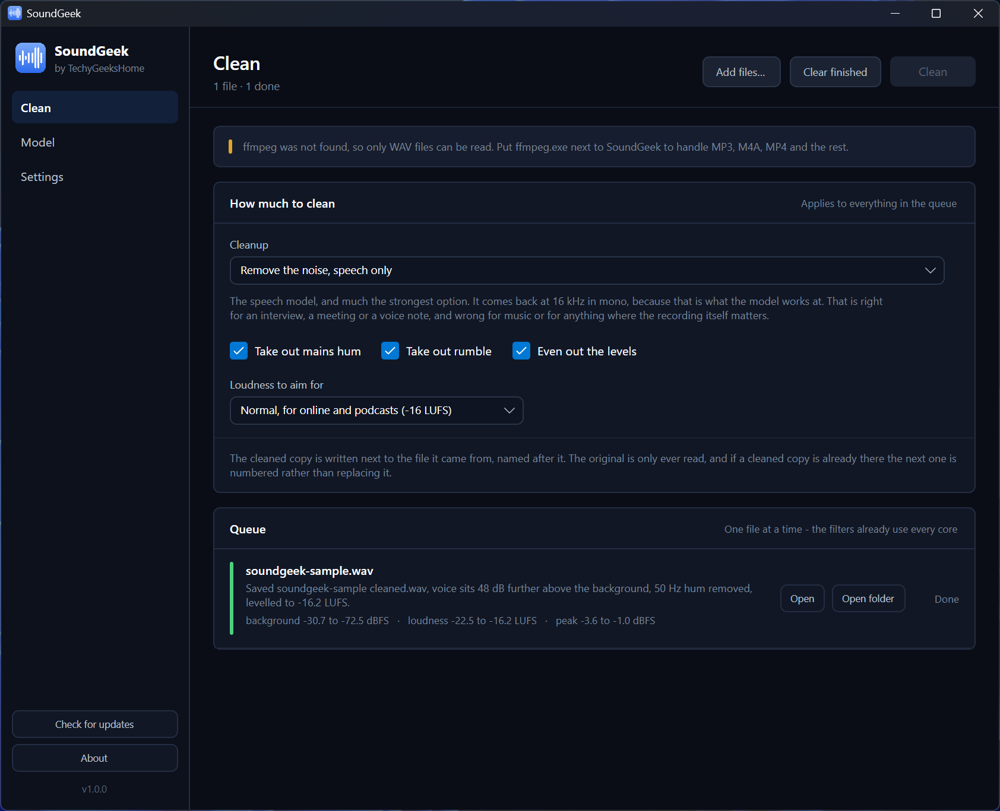
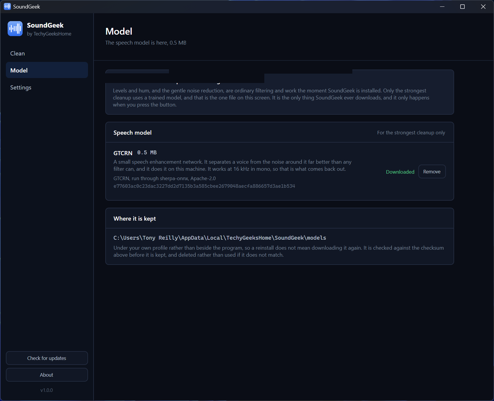
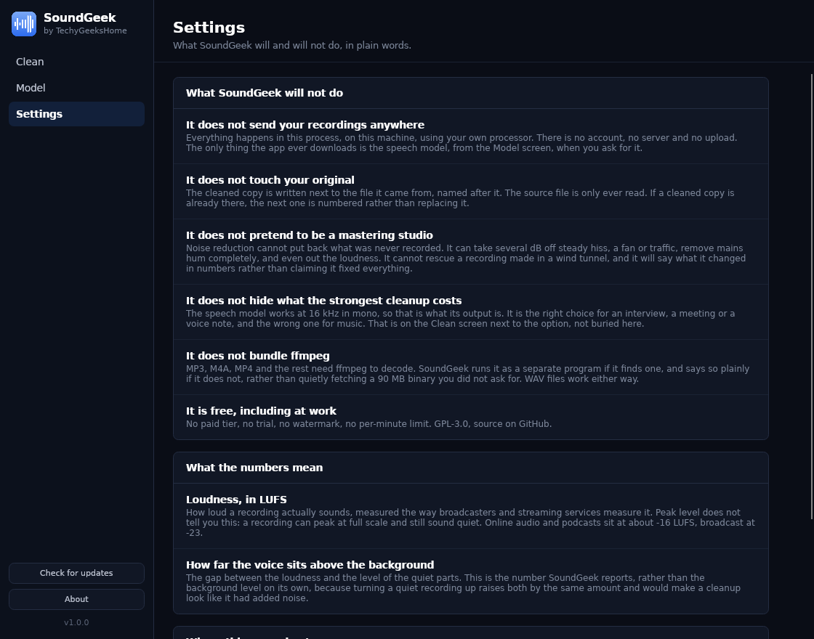

<div align="center">



# SoundGeek

**Clean up a recording on your own machine. Background noise gone, mains hum gone, levels evened out.**

[](https://github.com/techygeekshome/SoundGeek/actions/workflows/build.yml)
[](https://github.com/techygeekshome/SoundGeek/releases)
[](#download)
[](LICENSE)
[](https://techygeekshome.info)
[](https://ko-fi.com/techygeekshome)

[Download](#download) · [What it does](#what-it-does) · [Three ways to clean](#three-ways-to-clean) · [The model](#the-model) · [Requirements](#requirements)

</div>

---

## 🎬 See it in action

[](https://www.youtube.com/watch?v=ssu5cK18Q3Y)

What it actually does to a noisy recording, in under a minute.

---

Drop in a recording and SoundGeek writes a cleaned copy beside it: background noise gone, mains
hum gone, levels evened out. It runs entirely on this machine, so an interview or a meeting never
leaves the computer it is on. No account, no upload, no per-minute limit, no watermark.

Part of the [TechyGeeksHome](https://techygeekshome.info/geek-tools/) range.

---

## Download

**[Download the latest release](https://github.com/techygeekshome/SoundGeek/releases/latest)**, or read about it on the
**[SoundGeek product page](https://techygeekshome.info/soundgeek/)**.

Windows 10 or 11, 64-bit. Nothing else to install.

---

## What it does

- Reads WAV, MP3, M4A, FLAC, OGG, Opus, WMA, AAC, MP4, MKV, MOV, AVI, WebM
- Removes steady background noise: hiss, a fan, traffic, room tone
- Finds and removes mains hum completely, 50 Hz or 60 Hz, measured rather than assumed
- Removes rumble: desk thumps, wind, traffic under 60 Hz
- Evens out the loudness to a target you pick, with a look-ahead limiter holding the peaks
- Queues as many files as you like and works through them one at a time
- Reports what it found and what it changed, in numbers


## Screenshots

**Clean** — pick how hard to clean, then see exactly what changed.



**The model** — two of the three cleanups need nothing downloaded at all.



**Settings** — a plain list of what SoundGeek will not do.



---

## Three ways to clean

| | What it does | What comes out |
|---|---|---|
| **Levels and hum only** | Hum and rumble out, loudness evened. Nothing touches the noise | Exactly as it went in |
| **Reduce the noise, keep the quality** | Filtering. Takes several dB off steady noise | Exactly as it went in |
| **Remove the noise, speech only** | The speech model. Much the strongest | 16 kHz mono |

The third option is the one that makes a bad recording usable, and it has a real cost: the model
works at 16 kHz in mono, so that is what comes back. That is right for an interview, a meeting or
a voice note, and wrong for music. SoundGeek says so on the screen next to the option rather than
in the small print.

---

## What it will not do

- **It does not send your recordings anywhere.** Everything happens in this process, on this
  machine. There is no account, no server and no upload. The only thing the app ever downloads is
  the speech model, from the Model screen, when you ask for it.
- **It does not touch your original.** The cleaned copy is written next to the file it came from
  and named after it. If one is already there, the next is numbered.
- **It does not pretend to be a mastering studio.** Noise reduction cannot put back what was never
  recorded. It will say what it changed in numbers rather than claiming it fixed everything.
- **It does not bundle ffmpeg.** MP3, M4A and the rest need ffmpeg to decode. SoundGeek runs it as
  a separate program if it finds one and says so plainly if it does not, rather than quietly
  fetching a 90 MB binary you did not ask for. WAV files work either way.

---

## The model

Half a megabyte, downloaded from the Model screen, never bundled. Two of the three cleanups do not
need it at all.

| File | Size | Origin | Licence |
|---|---|---|---|
| `gtcrn-speech-denoiser.onnx` | 536 KB | [GTCRN](https://github.com/Xiaobin-Rong/gtcrn) via [sherpa-onnx](https://github.com/k2-fsa/sherpa-onnx) | Apache-2.0 |

It is checked against an exact byte count and a SHA-256 recorded inside SoundGeek before it is
kept. A file that does not match is deleted rather than used, so the app runs the exact model it
was tested with or none at all.

---

## What the numbers mean

**Loudness, in LUFS.** How loud a recording actually sounds, measured to ITU-R BS.1770, the way
broadcasters and streaming services measure it. Peak level does not tell you this: a recording can
peak at full scale and still sound quiet. Online audio and podcasts sit at about -16 LUFS,
broadcast at -23.

**How far the voice sits above the background.** The gap between the loudness and the level of the
quiet parts. This is the number SoundGeek reports, rather than the background level on its own,
because turning a quiet recording up raises both by the same amount and would make a cleanup look
like it had added noise.

---

## Requirements

Windows 10 version 1809 or later, 64-bit. The .NET runtime is bundled, so there is nothing to
install first. ffmpeg is optional and only needed for formats other than WAV.

---

## Building

```
dotnet build SoundGeek.sln -c Release
dotnet run --project tests/SoundGeek.Tests -c Release
build.cmd installer
```

---

## Licence

GPL-3.0. Free to use, including at work. No paid tier, ever.
